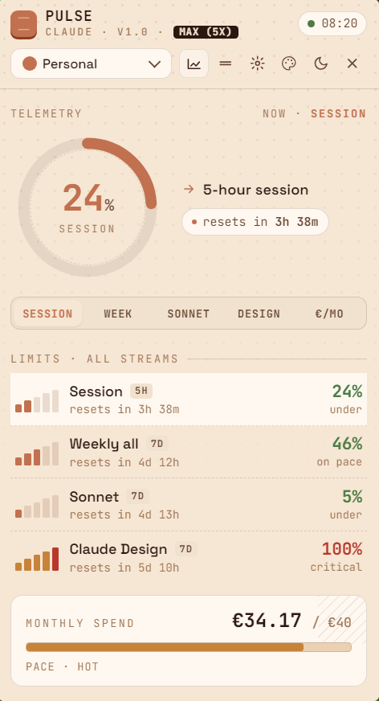
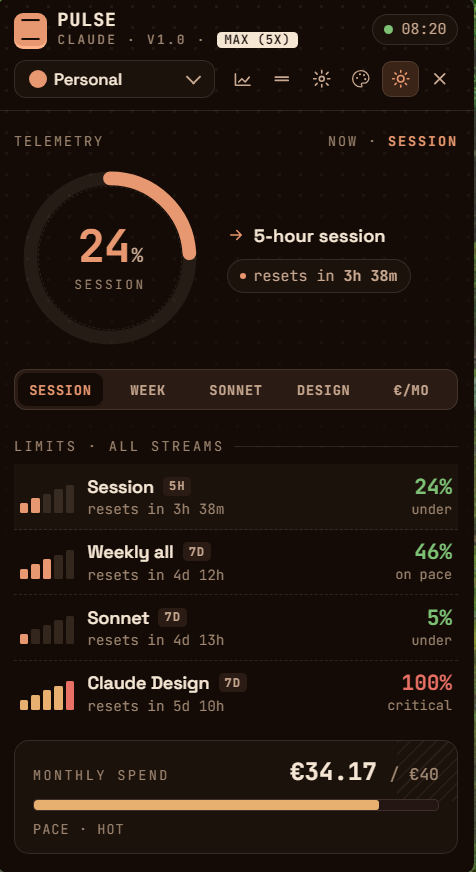
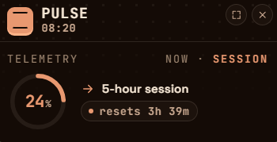

<div align="center">

# Claude Pulse

**Your Claude usage, at a glance.**

A minimal, beautiful Windows tray widget that shows your Claude AI usage in real time. Hover the tray icon and see your session, weekly, and monthly limits — without ever leaving what you're doing.

<!-- Add screenshot here once you have one in assets/screenshot.png -->
<!--  -->

[Download](#installation) · [Features](#features) · [Configuration](#configuration) · [Build from source](#build-from-source)

</div>

---

## Features

- **Real-time monitoring** — session (5h), weekly (all models / Sonnet / Design), monthly credit spend
- **Hover to peek, click to pin** — tray-native interaction, no taskbar clutter
- **Auto-login** — one click opens claude.ai in a window; session is captured automatically
- **Multi-profile** — unlimited Claude accounts (Personal, Work, etc.), switch from the header dropdown
- **Usage alerts** — Windows toast notifications at 75% / 90% / 95% and on session reset
- **Trend prediction** — "~45 min to 100%" based on your current usage rate
- **7-day history** — optional graph showing session and weekly trends over time
- **5 themes** — Copper, Ocean, Forest, Purple, Mono, each with a dark variant
- **Compact mode** — shrinks to a donut-only mini-widget when you need the screen space
- **Draggable** — position it anywhere; your choice is remembered across restarts
- **Keyboard shortcuts** — `Ctrl+Shift+C` to toggle, `Ctrl+Shift+R` to reload
- **Privacy-first** — everything runs locally, no telemetry, no cloud sync

## Screenshots

<!-- Add these once you've taken screenshots. See CONTRIBUTING notes below. -->

<table>
<tr>
<td align="center"><b>Normal</b></td>
<td align="center"><b>Dark mode</b></td>
<td align="center"><b>Compact</b></td>
</tr>
<tr>
<td></td>
<td></td>
<td></td>
</tr>
</table>

## Installation

### Download the installer (recommended)

1. Head to [Releases](https://github.com/Philip8891/claude-pulse/releases/latest)
2. Download **`Claude Pulse-Setup-1.0.0.exe`** (installer) or **`Claude Pulse-Portable-1.0.0.exe`** (no install needed)
3. Run it — the tray icon appears and a welcome screen guides you through login

> **No Python, no Node.js required.** Everything is bundled. Just download and run.

### Build from source

See [BUILD.md](BUILD.md) for the full build process. Quick version:

```cmd
git clone https://github.com/Philip8891/claude-pulse.git
cd claude-pulse
npm install
npm start
```

Requires Node.js 18+ and Python 3.8+. To produce a standalone `.exe`, you'll also need PyInstaller (`pip install pyinstaller`) and run `npm run build:installer`.

## First-time setup

On first launch, Claude Pulse shows a **Welcome** screen with two options:

### Option A — Auto-login (one click, recommended)

1. Click **"Log in with Claude"**
2. A browser-like window opens to claude.ai/login
3. Log in normally (email + password, or Google/SSO)
4. Claude Pulse captures your session automatically, closes the window, and starts monitoring

### Option B — Manual setup (advanced)

Open the manual setup section and fill in:

- **Session Cookie** — on claude.ai, press F12 → Application → Cookies → copy the `sessionKey` value
- **Organization ID** — on claude.ai, open the browser console (F12) and run:
  ```js
  fetch('/api/organizations').then(r => r.json()).then(o => console.log(o[0].uuid))
  ```
- **CF Clearance** *(optional)* — only if you hit Cloudflare challenges

Click **Test** to verify, then **Save**.

## Usage

**Hover** the tray icon to peek at your usage. **Click** to pin the widget open (it stays visible and focusable). **Click again** to unpin. **Right-click** the tray icon for the full menu (login, reset position, quit, etc.).

**Drag the widget** by its header to move it anywhere on screen. The position is remembered next time you open it.

### Compact mode

Click the rectangle icon (□) in the widget header to shrink to a minimal donut-only view (~220×95 px). An exit button (□) appears in the top-right corner to expand back.

### History graph

Click the chart icon (📈) to toggle a 7-day usage trend below the main view. Data is sampled every 5 minutes and stored locally — so first the first point appears ~5 minutes after first launch.

### Multi-profile

Use the dropdown in the widget header to switch between accounts instantly. Manage profiles in **Settings → Profiles** tab.

## Keyboard shortcuts

| Shortcut | Action |
|---|---|
| `Ctrl+Shift+C` | Show/hide widget |
| `Ctrl+Shift+R` | Force reload data |

## Data & privacy

All data stays on your machine. Claude Pulse only makes two kinds of network requests:

1. **`claude.ai/api/organizations/*/usage`** — to fetch your own usage data, using your session cookie
2. **`localhost:8787`** — internal proxy between the Electron app and claude.ai

No telemetry, no analytics, no cloud sync, no third-party servers. Your `sessionKey` never leaves your machine.

### Data locations

| Path | Contents |
|---|---|
| `%USERPROFILE%\.claude-pulse\config.json` | Profiles (name, sessionKey, orgId) |
| `%USERPROFILE%\.claude-pulse\settings.json` | Window position, compact preference |
| `%USERPROFILE%\.claude-pulse\ui-state.json` | Theme, dark mode, toggles |
| `%USERPROFILE%\.claude-pulse\history.json` | 7-day usage samples |

To reset Claude Pulse completely, delete the `.claude-pulse` folder.

## Autostart on Windows login

Easiest way: after installing, create a shortcut to **Claude Pulse.exe** and place it in your Startup folder.

1. Press `Win+R`, type `shell:startup`, Enter
2. Drag the Claude Pulse shortcut from your Start menu into that folder

## How it works

```
  ┌─────────────────────────┐
  │   Electron tray app     │
  │   (main.js + widget)    │
  └───────────┬─────────────┘
              │  HTTP
              ▼
  ┌─────────────────────────┐
  │   Local proxy           │
  │   (proxy.exe :8787)     │
  │   – caching             │
  │   – multi-profile       │
  │   – history sampling    │
  └───────────┬─────────────┘
              │  HTTPS + sessionKey
              ▼
  ┌─────────────────────────┐
  │   claude.ai             │
  │   /api/orgs/*/usage     │
  └─────────────────────────┘
```

- **Electron (main.js)** — tray icon, popup window, global shortcuts, notifications, auto-login flow
- **Local proxy (proxy.py → proxy.exe)** — a thin caching layer at `localhost:8787`; fetches usage every 60 s, serves the widget HTML and a small JSON API
- **Widget (widget.html)** — the UI; renders donut, rows, monthly bar, history graph, modal settings

In the packaged `.exe`, the proxy is compiled with PyInstaller into a single self-contained `proxy.exe` and bundled alongside Electron — so end users never need to install Python or Node.js.

## Troubleshooting

<details>
<summary><b>Widget shows "offline"</b></summary>

The proxy isn't responding. Common causes:
- Another app is using port `8787` — check with `netstat -ano | findstr :8787`
- Antivirus blocked `proxy.exe` — add an exception in Windows Defender
- In dev mode: run `python proxy.py` manually in a terminal to see errors

</details>

<details>
<summary><b>"Session expired" banner</b></summary>

Cookies expire after ~30 days. Click the red banner or open Settings → use **Log in with Claude** to re-authenticate. No need to copy cookies again.

</details>

<details>
<summary><b>"Forbidden (403)" when testing a profile</b></summary>

Cloudflare is challenging the request. Solutions:
- Visit claude.ai in a normal browser first to pass any challenges
- Copy your `cf_clearance` cookie into the optional field in Settings

</details>

<details>
<summary><b>Popup appears off-screen after switching monitors</b></summary>

Right-click the tray icon → **Reset window position**.

</details>

<details>
<summary><b>Tray icon disappears / hidden behind the arrow</b></summary>

Open the hidden-icons menu (the `^` arrow on the taskbar), right-click the Claude Pulse icon, and choose "Show in taskbar" or drag it into the visible area.

</details>

<details>
<summary><b>Windows Defender blocks the installer</b></summary>

Unsigned `.exe` files sometimes trigger SmartScreen. Click **More info** → **Run anyway**. To avoid this, code-sign the binary (requires a paid certificate).

</details>

## Contributing

Issues and pull requests are welcome. For bigger changes, please open an issue first to discuss what you'd like to change.

## License

[MIT](LICENSE) © 2026 László Fülöp

Claude Pulse is an unofficial, third-party tool. It is not affiliated with, endorsed by, or sponsored by Anthropic PBC. "Claude" is a trademark of Anthropic PBC.

## Credits

Inspiration and prior art from the Claude-usage-monitoring community:

- [hamed-elfayome/Claude-Usage-Tracker](https://github.com/hamed-elfayome/Claude-Usage-Tracker) — usage API endpoint structure
- [SlavomirDurej/claude-usage-widget](https://github.com/SlavomirDurej/claude-usage-widget) — cookie-capture via Electron window
- [lugia19/Claude-Usage-Extension](https://github.com/lugia19/Claude-Usage-Extension) — browser-extension approach
- [utajum/claude-usage](https://github.com/utajum/claude-usage) — Go-based alternative
